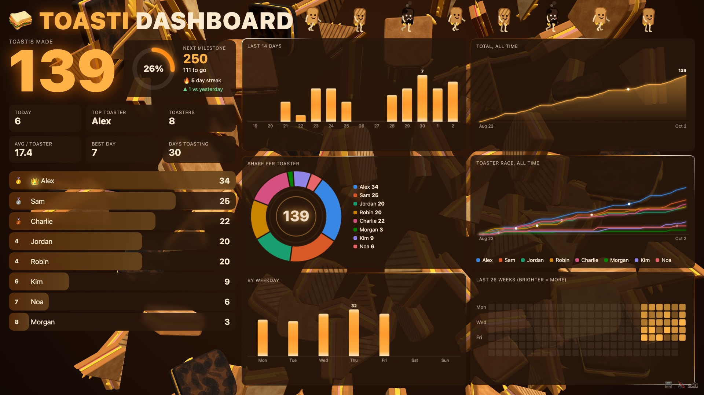
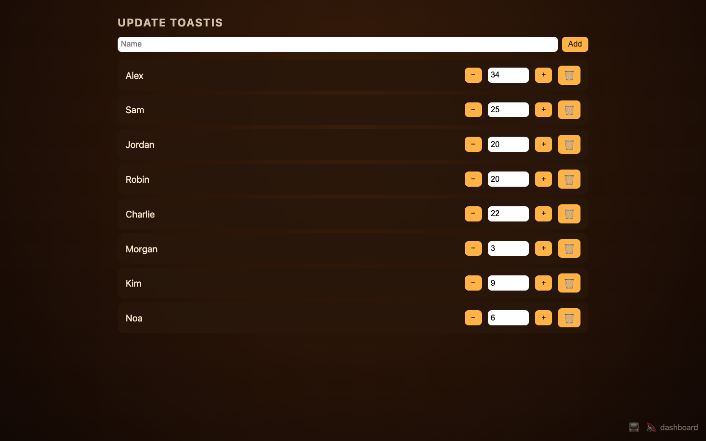

# 🥪 Toasti Dashboard

A leaderboard for counting toasties, meant to run on an office TV.





## Run

```sh
node server.js
```

Open http://localhost:3000. It needs Node.js and nothing else: no `npm install`. Set `PORT` to use another port.

- `/` is the dashboard.
- `/#edit` is where you add people and update counts.

The data is saved to `data.json`, which is created on the first save. Open dashboards pick up changes automatically, and reload themselves when `index.html` changes.

## Logo

The header shows `capisoft-logo.png` if that file exists next to `server.js`. It isn't included in this repo; without it the spot stays empty.

## Security

There is no login. Anyone who can reach the server can change the data, so run it only on a network you trust.

## License

[MIT](LICENSE)
